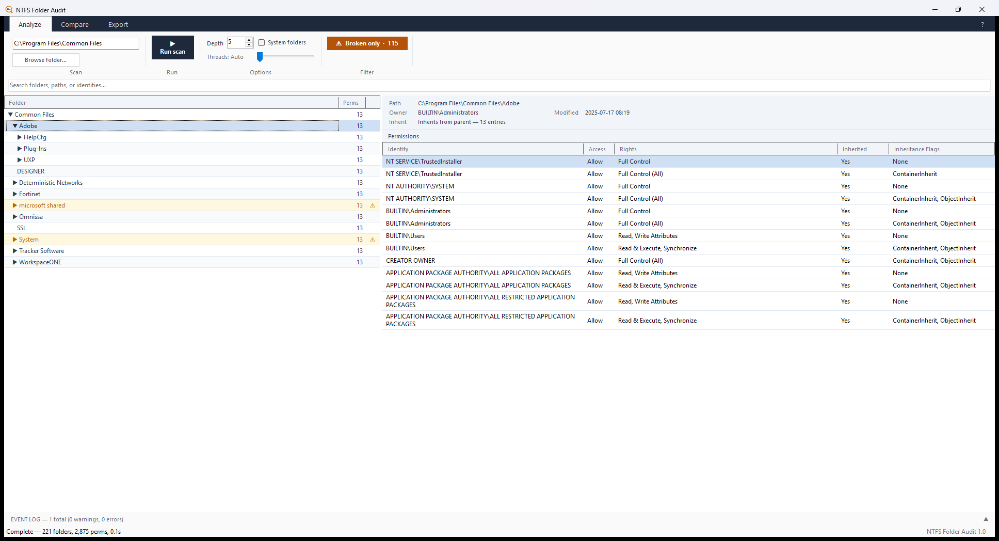

# NTFS Folder Audit

Audit NTFS folder permissions on Windows. Scan a local path or a UNC share, see
exactly who has access to what, spot folders where inheritance has been broken,
and hand your client an interactive HTML report.



## Free. Actually free.

No licence key. No trial timer. No feature gating. No account. No nag screens.

Every feature listed on this page works the moment you download it:

| | |
|---|---|
| Licence key required | **No** — there is no activation step at all |
| Trial period | **No** — it does not expire |
| Locked features | **No** — nothing is held back for a paid tier |
| Folder or scan limits | **No** — scan as deep and as wide as you like |
| Account or sign-up | **No** |
| Watermarks on reports | **No** |
| Network connections | **None** — see below |

**It never phones home.** The tool contains no HTTP client, no telemetry and no
analytics. The only URLs anywhere in the source are three links in the About
dialog that open in *your* browser when *you* click them. It reads the
filesystem and writes the report you asked for; that is all. Drop it on an
isolated network and it behaves identically.

If it saves you an afternoon of clicking through Security tabs, you're welcome to
[buy me a coffee](https://paypal.me/ProDirtLLC). That's the whole business model.
Nothing changes in the app whether you do or not.

## What it does

- **Scan** any local path or UNC share to a depth you choose, with a permissions
  grid showing identity, access type, decoded rights, inheritance state and flags.
- **Find broken inheritance** — folders whose ACLs are set explicitly rather than
  inherited from the parent. These are either a deliberate security boundary or a
  mistake, and they're the first thing worth reviewing in any audit. One click
  filters the tree down to only those folders.
- **See ownership** — the owner account is shown per folder, including
  unresolvable SIDs left behind by deleted accounts.
- **Compare two paths** side by side. Point it at a share and its backup, or at
  two client folders that are supposed to match, and it highlights every folder
  whose permissions differ, plus anything present on only one side.
- **Export** a self-contained interactive HTML report (searchable, expandable,
  no external dependencies) or a flat CSV for a spreadsheet.
- **Surface access-denied folders** in an event log, so you know which paths
  could *not* be read rather than silently reporting them as empty.

## Download

Grab the latest `NTFSFolderAudit.exe` from
[Releases](https://github.com/prodirt-llc/ntfs-folder-audit/releases).

There's no installer. It's a single self-contained executable — copy it to a
tools folder or a USB stick and run it. Nothing is written to Program Files, and
no runtime needs installing.

The download is large (~155 MB) because the .NET runtime is bundled inside it.
That's the trade for "copy it to any server and it just runs", which matters more
than download size when you're working on a client's file server.

## Requirements

- Windows 10, Windows 11, or Windows Server 2016+
- No .NET install required — the runtime is included

**Run it as Administrator.** It works without elevation, but any folder whose
ACL your account can't read will come back as access-denied. Those show up in the
event log rather than being silently skipped, so you'll know what you missed.

## Command line

The same engine runs headless, which is handy for scheduled audits:

```
NTFSFolderAudit.exe --path <path> [options]
```

| Option | |
|---|---|
| `--path <path>` | Root path to scan (local or UNC) |
| `--output <file>` | Output HTML file path (default: Desktop) |
| `--csv <file>` | Also export a CSV file |
| `--depth <n>` | Max folder depth (default: 5) |
| `--exclude-system` | Skip Windows/ProgramData and similar folders |
| `--open` | Open the HTML report once it's generated |

```
NTFSFolderAudit.exe --path \\server\share --output report.html --depth 3
NTFSFolderAudit.exe --path C:\Shares --exclude-system --csv perms.csv --open
```

## Building from source

Requires the .NET 8 SDK.

```
dotnet build -c Release
dotnet publish NTFSFolderAudit.csproj -c Release --output ./publish
```

The app icon is generated rather than hand-edited — `python make_icon.py`
rebuilds `app.ico`, `icon.png` and `icon.svg` from one set of constants
(needs `pillow`).

## Support

Bug reports and feature requests are welcome in
[Issues](https://github.com/prodirt-llc/ntfs-folder-audit/issues).

Built by [ProDirt](https://prodirt-llc.github.io).
